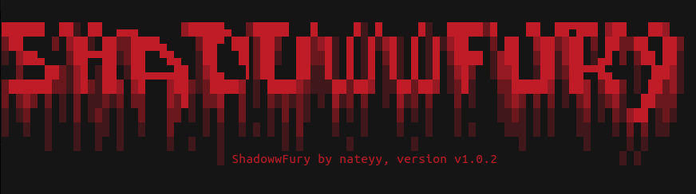

<!-- Improved compatibility of back to top link: See: https://github.com/othneildrew/Best-README-Template/pull/73 -->
<a name="readme-top"></a>
<!--
*** Thanks for checking out the Best-README-Template. If you have a suggestion
*** that would make this better, please fork the repo and create a pull request
*** or simply open an issue with the tag "enhancement".
*** Don't forget to give the project a star!
*** Thanks again! Now go create something AMAZING! :D
-->


<!-- PROJECT SHIELDS -->
<!--
*** I'm using markdown "reference style" links for readability.
*** Reference links are enclosed in brackets [ ] instead of parentheses ( ).
*** See the bottom of this document for the declaration of the reference variables
*** for contributors-url, forks-url, etc. This is an optional, concise syntax you may use.
*** https://www.markdownguide.org/basic-syntax/#reference-style-links
-->


<!-- PROJECT LOGO -->
<br />
<div align="center">
  <a href="">
    
  </a>

  <h3 align="center">SHADOWWFURY</h3>

  <p align="center">
    A very ease to use DDoS Tool!
    <br />
    <a href=""><strong>Explore the docs »</strong></a>
    <br />
    <br />
    <a href="">View Demo</a>
    ·
    <a href="">Report Bug</a>
    ·
    <a href="">Request Feature</a>
  </p>
</div>


<!-- TABLE OF CONTENTS -->
<details>
  <summary>Table of Contents</summary>
  <ol>
    <li>
      <a href="#What-is-ShadowwFury?">About The Project</a>
      <ul>
      </ul>
    </li>
    <li>
      <a href="#installation">Getting Started</a>
      <ul>
        <li><a href="#prerequisites">Prerequisites</a></li>
        <li><a href="#installation">Installation</a></li>
      </ul>
    </li>
    <li><a href="#usage">Usage</a></li>
    <li><a href="#roadmap">Roadmap</a></li>
    <li><a href="#contributing">Contributing</a></li>
    <li><a href="#license">License</a></li>
    <li><a href="#contact">Contact</a></li>
  </ol>
</details>

<!-- GETTING STARTED -->
## Getting Started
Here you will get a brief explaination, of how you can use and install ShadowwFury:)

### Prerequisites

Make sure you have all the necessary Tools installed in order for this to work
* pip
  ```sh
  pip install -r requirements.txt
  ```

### Installation

Here you will learn how to safley install ShadowwFury on your computer.

1. Clone the repo
   ```sh
   git clone https://github.com/nateyy9/ShadowwFury
   ```
2. Access the folder
   ```sh
   cd ShadowwFury
   ```
3. Run `shadowfury.py`
   ```js
   python3 shadowfury.py
   ```
4. Add arguments shown later


<p align="right">(<a href="#readme-top">back to top</a>)</p>


<!-- USAGE EXAMPLES -->
## Usage

ShadowwFury is a extremly basic DDoS Tool that can cause some Serious Damage.
if you are concerned about the legal issues of ShadowwFury, please refer to the MIT LICENSE.

The actual ussage of ShadowwFury is:

```sh
python3 shadowfury.py [Target IP/URL] [Threads] [Time in seconds]
```

examples:
```sh
python3 shadowfury.py hackthissite.org 500 400
```
```sh
python3 shadowfury.py testfire.net 400 1000
```


<p align="right">(<a href="#readme-top">back to top</a>)</p>

<!-- CONTRIBUTING -->
## Contributing

Contributions are what make the open source community such an amazing place to learn, inspire, and create. Any contributions you make are **greatly appreciated**.

If you have a suggestion that would make this better, please fork the repo and create a pull request. You can also simply open an issue with the tag "enhancement".
Don't forget to give the project a star! Thanks again!

1. Fork the Project
2. Create your Feature Branch (`git checkout -b feature/AmazingFeature`)
3. Commit your Changes (`git commit -m 'Add some AmazingFeature'`)
4. Push to the Branch (`git push origin feature/AmazingFeature`)
5. Open a Pull Request

<p align="right">(<a href="#readme-top">back to top</a>)</p>


<!-- LICENSE -->
## License

Distributed under the MIT License. See `LICENSE` for more information.

<p align="right">(<a href="#readme-top">back to top</a>)</p>


<!-- CONTACT -->
## Contact

nateyy - [@linux.xhacking](https://instagram.com/linux.xhacking) 

Project Link: [https://github.com/nateyy9/ShadowwFury](https://github.com/nateyy9/ShadowwFury)

<p align="right">(<a href="#readme-top">back to top</a>)</p>


